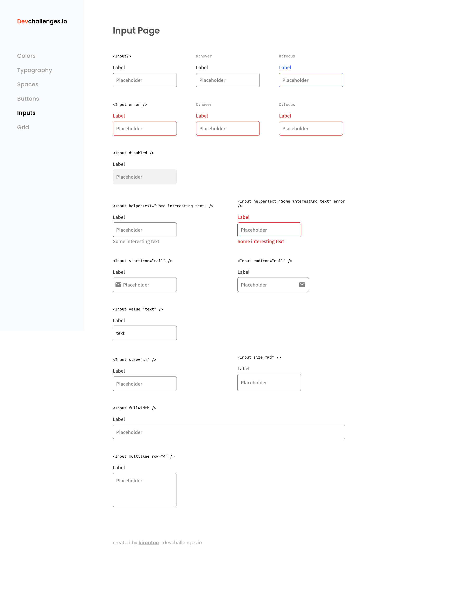

<!-- Please update value in the {}  -->

<h1 align="center">Input Components</h1>

<div align="center">
   Solution for a challenge from  <a href="http://devchallenges.io" target="_blank">Devchallenges.io</a>.
</div>

<div align="center">
  <h3>
    <a href="https://kirontoo-dc-input-component.netlify.app/">
      Demo
    </a>
    <span> | </span>
    <a href="https://devchallenges.io/solutions/TlNOSGNtGoJlKW2Dtuqa">
      Solution
    </a>
    <span> | </span>
    <a href="https://devchallenges.io/challenges/TSqutYM4c5WtluM7QzGp">
      Challenge
    </a>
  </h3>
</div>

<!-- TABLE OF CONTENTS -->

## Table of Contents

- [Overview](#overview)
  - [Built With](#built-with)
- [Features](#features)
- [How to use](#how-to-use)
- [Contact](#contact)
- [Acknowledgements](#acknowledgements)

<!-- OVERVIEW -->

## Overview



This project was easier than the previous one since it is an improvement from the `button-component project`.
I added some routing to the sidebar so that you can still see the button components and a 404 page.
From this project, I learned how to position icons inside an input without it misaligning in different device widths.

### Built With

<!-- This section should list any major frameworks that you built your project using. Here are a few examples.-->

- HTML
- CSS
- Javascript
- [React](https://reactjs.org/)
- [Styled Components](https://styled-components.com/)

## Features

<!-- List the features of your application or follow the template. Don't share the figma file here :) -->

This application/site was created as a submission to a [DevChallenges](https://devchallenges.io/challenges) challenge. The [challenge](https://devchallenges.io/challenges/ohgVTyJCbm5OZyTB2gNY) was to build an application to complete the given user stories.

## How To Use

<!-- This is an example, please update according to your application -->

To clone and run this application, you'll need [Git](https://git-scm.com) and [Node.js](https://nodejs.org/en/download/) (which comes with [npm](http://npmjs.com)) installed on your computer. From your command line:

```bash
# Clone this repository
$ git clone https://github.com/kirontoo/devchallenges.git

# Navigate to the project folder
$ cd ./frontend-end-developer/input-component

# Install dependencies
$ npm install

# Run the app
$ npm start
```

## Acknowledgements

<!-- This section should list any articles or add-ons/plugins that helps you to complete the project. This is optional but it will help you in the future. For exmpale -->

- [Material Icons](https://google.github.io/material-design-icons/)
- [Styled Components Quickstart Guide](https://scalablecss.com/styled-components-quickstart-guide/)
- [React Router](https://blog.logrocket.com/react-router-dom-set-up-essential-components-parameterized-routes-505dc93642f1/)

## Contact

- GitHub [@kirontoo](https://github.com/kirontoo)
